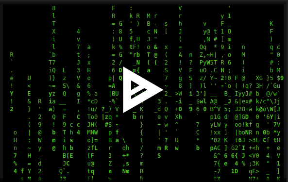

# matrix.dot.files

Enter the matrix of dot files. 

[](https://asciinema.org/a/9scvu667GH2hCvO1aAlPl1cww?autoplay=1)

The core concept is to have a unified modern experience across all POSIX systems.

## Hooking into the matrix

Use an application like [homesick rubygem](https://github.com/technicalpickles/homesick) or [homeshick bash script](https://github.com/andsens/homeshick).

### Getting Started

You use the homesick command to clone a castle (the matrix):

```shell
homesick clone git://github.com/shadowbq/matrix.dot.files.git
```

-or-

```shell
homesick clone https://github.com/shadowbq/matrix.dot.files.git
```

Next symlink the matrix to your $HOME

```shell
homesick symlink matrix.dot.files
```

Note: you may not want to accept the (.ssh) directory.

Show the available castles:

```shell
homesick list
```

## Configuration

`.matrix_config` in your home directory is where your personal changes should go.

You can avoid error on **matrix local consistency** checks by adding this git nugget.

```shell
$> git update-index --skip-worktree home/.matrix_config
$> git ls-files -v . |grep ^S
S home/.matrix_config
```

Local files can be added to a singular system for individual enhancement.

```shell
.bash_local
.bash_aliases
```

Secure files like these are ignored from the repo in the `.gitignore`

```shell
.secrets
.bash_encrypted
.ssh/*.pem
.ssh/*.key
.ssh/id*
```

## The Docs

Read the Docs, as they are very helpful in getting unstuck, or installed correctly in each section.

```
./README.md - The site README

docs/README.md - Navigating the DOCS
```

Installation and Setup Guides for the extentions

```
docs/README.bash.md
docs/README.go.md
docs/README.nodejs.md
docs/README.os.bsd.md
docs/README.os.linux.md
docs/README.os.macos.md
docs/README.os.win10.md
docs/README.powerline.md
docs/README.proxied.md
docs/README.python.md
docs/README.ruby.md
docs/README.secrets.md
docs/README.vim.md
```

Additional tools included that don't include instructions

```
docs/tools/README.ack.md
docs/tools/README.prettyprint.md
docs/tools/README.randomz.md
docs/tools/README.rmate.md
```

## Dependencies

The Matrix has a few dependencies if you are going to use it.

* Sane setups with gplv3-coreutils and brew on macos
* Ruby, RVM and a set of GEMs
* VI with Vundle
* TMUX with TPM bundles with Powerline Python3
* NPM with Node NVM
* Bash with Airline (slimmer Powerline option)

Run the matrix dependency checker to get a good start on ensuring a SANE environment

`.matrix/bin/check_matrix_dependencies`

## File Hierarchy

### Global Directive

```shell
.bash_profile
```

bash_profile is the primary universal include directive file that autoloads .matrix directives 

### Matrix

```shell
.bash_matrix
```

bash_matrix defines what additional include directives to load from the matrix (configure your load out here)

```shell
.matrix
```

matrixdirectory holds all additional plugins 

* OS specific - load paths, bins, aliases, advisors
              - (./Darwin/.bash_extensions)
* Global bins - cross platform shell scripts (xpull, rmate, ssh-copy-id, epoch, etc.. )
* Rubygems in bundler format that improve experience
* Additional functions, environment needs, and mockups

### Other Files

```shell
.bashrc
.bash_logout
```

Local files for ENV changes that are excluded from unified profile (SECRETS)

```shell
.gitconfig
.gitignore-global
```

Standardized .git configs

```shell
.irbrc
.curlrc
.....(others)
```

Other .file(s) that can enhance the unified experience

## More Help

For More help please the `/docs` directory/..
