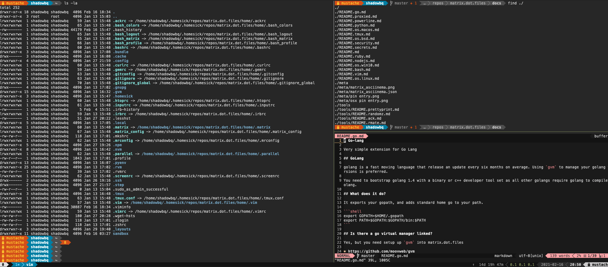

# matrix.dot.files

A Unified Modern *Bash* Experience Across All POSIX Systems.

Enter the matrix of dot files. - [Since May 25, 2012](https://github.com/shadowbq/matrix.dot.files/tree/b98643c87094edf3807368c7e765df1fcc350d2d)

[](README.md)

## Highlights

* Native `bash 3.x/4.x` supported shell.
* Language versions managers like RVM/PYENV/GVM/NVM 
* Security with SSH Agents, GPG Env Secrets, and Proxies
* Essential out of the box tooling like GIT, TMUX, VIM.
* Colors and Themes with Powerline and TPM.
* Docker aware, and K8s tooling
* Sanity checks for Bash GNU gpl2 tools, built in bash functions, and matrix update consistency.

## Hooking into the matrix

Use an application like [homesick rubygem](https://github.com/technicalpickles/homesick) or [homeshick bash script](https://github.com/andsens/homeshick).

### Getting Started

You use the homesick command to clone a castle (the matrix):

```shell
homesick clone git://github.com/shadowbq/matrix.dot.files.git
```

-or-

```shell
homesick clone https://github.com/shadowbq/matrix.dot.files.git
```

Next symlink the matrix to your $HOME

```shell
homesick symlink matrix.dot.files
```

Note: you may not want to accept the (.ssh) directory.

Show the available castles:

```shell
homesick list
```

## Configuration

`.matrix_config` in your home directory is where your personal changes should go.

You can avoid error on **matrix local consistency** checks by adding this git nugget.

```shell
$> git update-index --skip-worktree home/.matrix_config
$> git ls-files -v . |grep ^S
S home/.matrix_config
```

Local files can be added to a singular system for individual enhancement.

```shell
.bash_local
.bash_aliases
```

Secure files like these are ignored from the repo in the `.gitignore`

```shell
.secrets
.bash_encrypted
.ssh/*.pem
.ssh/*.key
.ssh/id*
```

## The Docs

Read the Docs, as they are very helpful in getting unstuck, or installed correctly in each section.

```
./README.md - The site README
```
### The Developers Opinion  

[README - Opinion](docs/README.md)  

### Operating Systems - Installation and Setup Guides for the extensions  

[README - BSD](docs/README.os.bsd.md)  
[README - LINUX](docs/README.os.linux.md)  
[README - MacOS](docs/README.os.macos.md)  
[README - Win10](docs/README.os.win10.md)  

### Languages - Installation and Setup Guides for the extensions  

[README - GoLang](docs/README.go.md)  
[README - Node.js](docs/README.nodejs.md)  
[README - Python](docs/README.python.md)  
[README - Ruby](docs/README.ruby.md)  

### Best Practices  

[README - Bash](docs/README.bash.md)  

### Controls - Installation and Setup Guides for the extensions  

[README - Security](docs/README.security.md)  
[README - TMUX](docs/README.tmux.md)  
[README - VIM](docs/README.vim.md)  
[README - Powerline](docs/README.powerline.md)  
[README - Proxies](docs/README.proxied.md)  
[README - Secrets](docs/README.secrets.md)  

### Additional 3rd Tools Manuals  

[README - ACK](docs/tools/README.ack.md)  
[README - PrettyPrint](docs/tools/README.prettyprint.md)  
[README - RANDOMZ](docs/tools/README.randomz.md)  
[README - RMATE](docs/tools/README.rmate.md)  

## Dependencies

The Matrix has a few dependencies if you are going to use it.

* Sane setups with gplv3-coreutils and brew on macos
* Ruby, RVM and a set of GEMs
* VI with Vundle
* TMUX with TPM bundles with Powerline Python3
* NPM with Node NVM
* Bash with Airline (slimmer Powerline option)

Run the matrix dependency checker to get a good start on ensuring a SANE environment

`.matrix/bin/check_matrix_dependencies`

## File Hierarchy

### Global Directive

```shell
.bash_profile
```

bash_profile is the primary universal include directive file that autoloads dot.matrix directives 

### Matrix

bash_matrix defines what additional include directives to load from the matrix (configure your load out here)

```shell
.bash_matrix
```

`.matrix` directory holds all additional plugins 

* OS specific - load paths, bins, aliases, advisors
              - (./Darwin/.bash_extensions)
* Global bins - cross platform shell scripts (xpull, rmate, ssh-copy-id, epoch, etc.. )
* Rubygems in bundler format that improve experience
* Additional functions, environment needs, and mockups


### Other Files

Additional actions on the Universal Profile

```shell
.bashrc           # NOTE: Bashrc are loaded by .bash_profile!
.bash_logout      # Performed during logout.
```


Standardized `.git` configs and shortcuts

```shell
.gitconfig
.gitignore-global
```

Other .file(s) that can enhance the unified experience

```shell
.irbrc
.curlrc
.....(others)
```

## Other Directories

There are some additional directories symlinked in to assist in application normalization

```
.config
.parallel
.vim
```

## More Help

* For More help please the `/docs` directory/..
* File an Issue on GITHUB
* Ask on StackHUB
