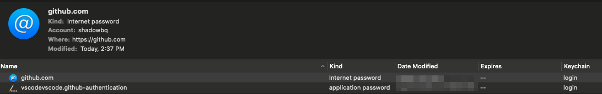

# GIT

`git` is essential to our everyday operations when using version control.

Git is awesome as plugins in the path slip into the main binary completion.

* Manage multiple users
* Fix Configs (ala proxies)
* Fetch hard get data
* etc..

## Secrets

You should use MDF Secrets if you don't / can't use SSH as the git protocol. In 2021 they will obsolete the use of passwords in github for HTTPS access to git repositories.

[README - Secrets](docs/README.secrets.md) - MDF Secrets with GPG and Bash

On a macOS:

Open KeyChain Access (Via spotlight search) → search GitHub → click GitHub → change and save with your new PAT link


### Password Obsolete -> Using the Personal Access Tokens 

*Warning*: Tokens have read/write access and should be treated like passwords. If you enter your token into the clone URL when cloning or adding a remote, Git writes it to your .git/config file in plain text, which is a security risk.

```shell
$> git push
remote: Support for password authentication was removed on August 13, 2021. Please use a personal access token instead.
remote: Please see https://github.blog/2020-12-15-token-authentication-requirements-for-git-operations/ for more information.
fatal: Authentication failed for 'https://github.com/shadowbq/matrix.dot.files.git/'
```

Remove old PW based origin, and convert to PAT. 
(Note: The space for not logging the history of the TOKEN)

```shell
git remote remove origin
 git remote add origin https://[USERNAME]:[NEW TOKEN]@github.com/[USERNAME]/[REPO].git
git push
```

### Generating Personal access tokens

Create an `admin:all` Personal access token in Github.

```ini
admin:all — admin:enterprise, admin:gpg_key, admin:org, admin:org_hook, admin:public_key, admin:repo_hook, delete:packages, delete_repo, gist, notifications, repo, user, workflow, write:discussion, write:packages
```

Save it as MDF Secret and load it via the GPG key method into your shell. Tokens are not passwords that you can set, so using secure mechanism to input the token is very important. 

### Optional: Git Credential Manager Core

Investigate the current credential setting:

```shell
$> git config --show-origin --get credential.helper
file:/Users/smacgregor/.gitconfig	osxkeychain
$> git config --global credential.helper`
```

Unset if not wanted/needed.

`git config --global --unset credential.helper`


[Git Credential Manager Core](https://github.com/microsoft/Git-Credential-Manager-Core) (GCM Core) is another way to store your credentials securely and connect to GitHub over HTTPS. With GCM Core, you don't have to manually [create and store a PAT](/github/authenticating-to-github/creating-a-personal-access-token), as GCM Core manages authentication on your behalf, including 2FA (two-factor authentication).

1. Install Git using [Homebrew](https://brew.sh/):
  ```shell
  $ brew install git
  ```

2. Install GCM Core using Homebrew:
  ```shell
  $ brew tap microsoft/git
  $ brew install --cask git-credential-manager-core
  ```
  For MacOS, you don't need to run `git config` because GCM Core automatically configures Git for you.

For Linux, install Git and GCM Core, then configure Git to use GCM Core.

1. Install Git from your distro's packaging system. Instructions will vary depending on the flavor of Linux you run.

2. Install GCM Core. See the [instructions in the GCM Core repo](https://github.com/microsoft/Git-Credential-Manager-Core#linux-install-instructions), as they'll vary depending on the flavor of Linux you run.

3. Configure Git to use GCM Core. There are several backing stores that you may choose from, so see the GCM Core docs to complete your setup. For more information, see "[GCM Core Linux](https://aka.ms/gcmcore-linuxcredstores)."

## Swap Users

`git swap` 

Example: Swap to user `shadowbq` in current checked out repo

```shell
$ git swap shadowbq
shadowbq <shadowbq@gmail.com>
```

Example Options:

```shell
usage: ./git swap <username in ~/.gitusers>
usage: ./git swap <username> <email>

Switch Local and Save to Config
usage: ./git swap [--new-user1 || -1] <username> <email>
usage: ./git swap [--new-user2 || -2] <username> <email>
usage: ./git swap [--new-user3 || -3] <username> <email>

Switch Global
usage: ./git swap [--global || -g] <username> <email>
```

### User Config

The configuration supports three different users [user1,user2,user3]

```ini
~/.gitusers
user1name="shadowbq"
user1email="shadowbq@gmail.com"
```

## Who Am I

`git whoami` - Show who you are based on global or local settings in a repo

```shell
$> git whoami
shadowbq <shadowbq@gmail.com>
```

## Downcase

Note: The global MDF in `~/.gitconfig` config is set to 'ignorecase'

Need I say more.. force downcase of filenames in repo. It will `git mv` the files to the new locations.
It will also set the current repo configuration:

`git config core.ignorecase false`

## Private Repos

The wack-o-mole of fetching HTTPS git private repos.

Example usage: 

```shell
export GITHUB_TOKEN=${GITHUB_TOKEN} 
git private "${git_tag}" myorg private-repo "${filename}" "${archive:?}/${filename}"
```

Example usage: *less secure*

```shell
GITHUB_TOKEN=ABCDEFGHIJ0123456789 git private v0.0.1 myorg private-repo foo.tar.gz /var/tmp/foo.tar.gz
```

## Proxy Clear

Clearing any proxy settings that may be attached to the current checked out repo.

## Others

md-toc-creator - Markdown Table of Contents Creations script.
